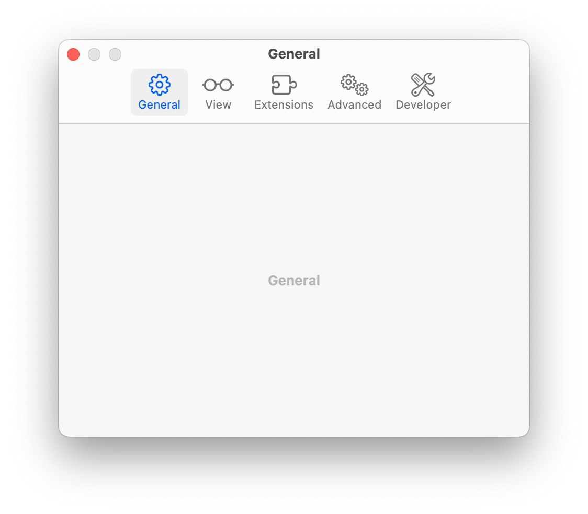
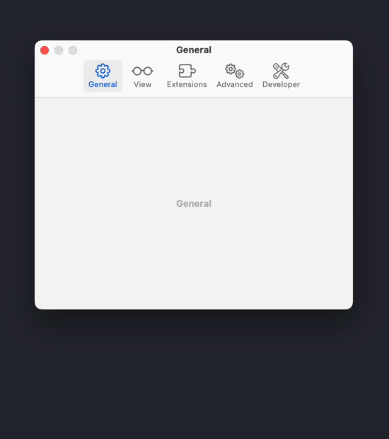
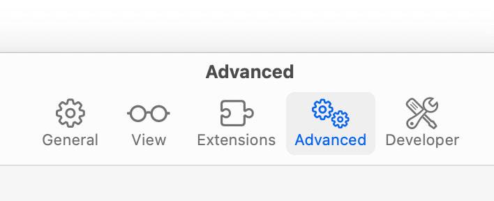
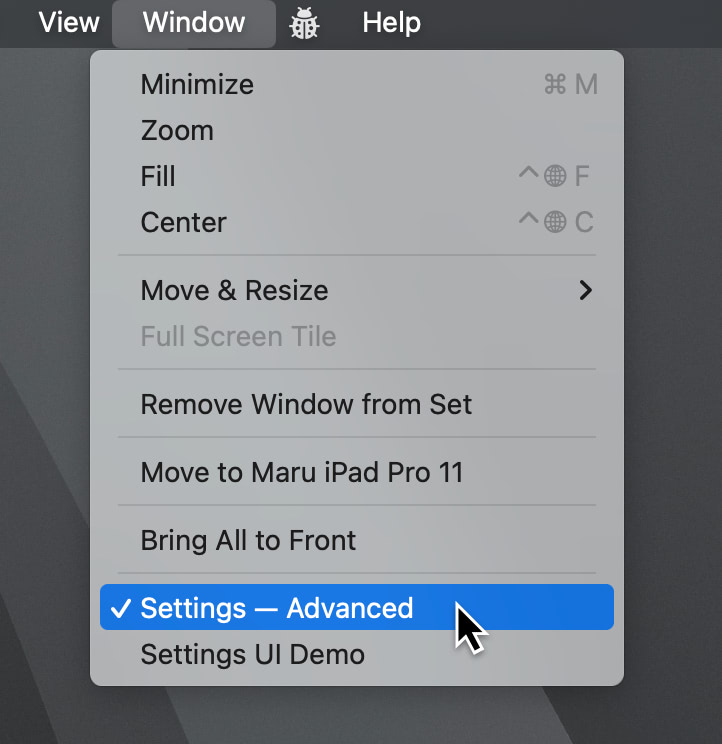
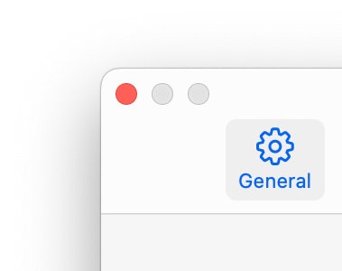
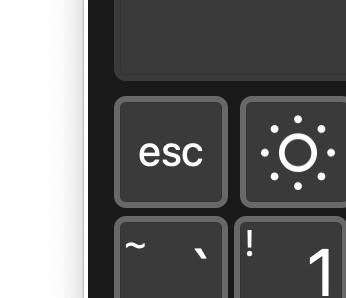

# MacAppSettingsUI

A package for make easier implementing a structure of settings / preferences UI for macOS AppKit-based apps.



## Design and Features

### Preferences-Style Toolbar with Animation

The window has preferences-style toolbar and native switching animation. It also supports “Reduce Motion” feature of accessibility.




### Window Title

Set active pane name as a window title automatically when panes are switched.




### Window Title with Active Pane Name on Window Menu

Display window title with pane name on the Window menu automatically.




### Only Close Button

Basically, the window only has a close button, but a zoom button is optional for per-pane.




### Press Escape Key to Close

We can use the Escape key `⎋` or `⌘.` action to close the window.




### Restorable Window Frame

The settings Window supports autosave frame via UserDefaults. The last window position can be restored automatically.


### Supported for Renamed “Settings”

On before macOS Ventura, “Settings” was “Preferences”. This module can also support renamed “Settings” after Ventura.

More details of this design (Japanese):
[macOS Venturaからの新しい“Settings”表記と、旧“Preferences”表記からの移行]
(https://zenn.dev/usagimaru/articles/de5012155f4916)


## Core Files

- `SettingsPaneViewController`
The base view controller for setting pane. You can use this class to customize your own.

- `SettingsWindowController`
WindowController for Settings window. You do not need to edit.

- `SettingsTabViewController`
WindowController’s contentViewController. You do not need to edit.


## Install
Use SwiftPM.


## Usage
To set panes of settings window, there are two ways of them.

### 1. Set panes as an array when initializing SettingsWindowController

```swift
var settingsWindowController: SettingsWindowController!

---

settingsWindowController = .init(with: [
	SettingsPaneViewController(tabName: "General",
							   tabImage: NSImage(systemSymbolName: "gearshape", accessibilityDescription: nil),
							   tabIdentifier: "general",
							   isResizableView: false),
	SettingsPaneViewController(tabName: "View",
							   tabImage: NSImage(systemSymbolName: "eyeglasses", accessibilityDescription: nil),
							   tabIdentifier: "view",
							   isResizableView: true),
	SettingsPaneViewController(tabName: "Extensions",
							   tabImage: NSImage(systemSymbolName: "puzzlepiece.extension", accessibilityDescription: nil),
							   tabIdentifier: "extensions",
							   isResizableView: false),
	SettingsPaneViewController(tabName: "Advanced",
							   tabImage: NSImage(systemSymbolName: "gearshape.2", accessibilityDescription: nil),
							   tabIdentifier: "advanced",
							   isResizableView: false),
])
```

### 2. Set panes to a SettingsTabViewController instance

```swift
func set(panes: [SettingsPaneViewController])
func add(pane: SettingsPaneViewController)
func insert(pane: SettingsPaneViewController, at index: Int)
func insert(tabViewItem: NSTabViewItem, at index: Int)
```

To remove any pane, use NSTabViewController’s methods.

## Appearance of Tabs

There are properties of tab item in SettingsPaneViewController.

- `tabName`
	- Alias of `NSViewController.title`.
- `tabImage`
- `tabIdentifier`
	- Should set to a unique name.

## Control window resizing on a per-pane

There is a property in SettingsPaneViewController. Set true to allow window resizing only while the pane is active. The default value is false. Check the Demo implementation and `Main` Storyboard file.

- `isResizableView`


## License

See [LICENSE](./LICENSE) for details.
