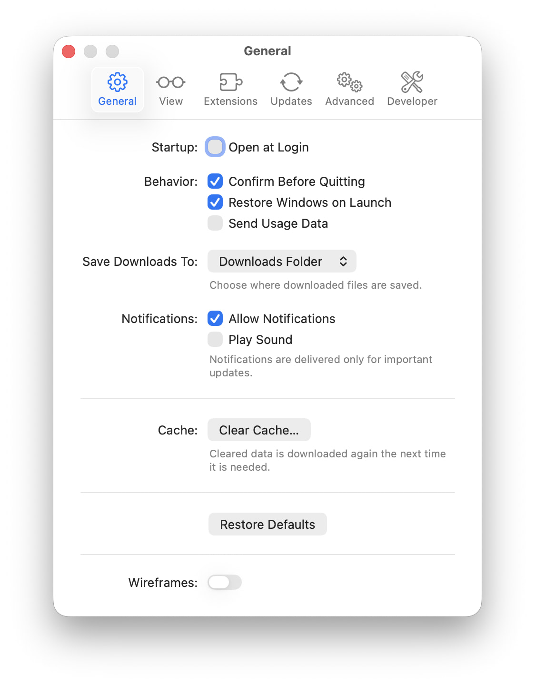
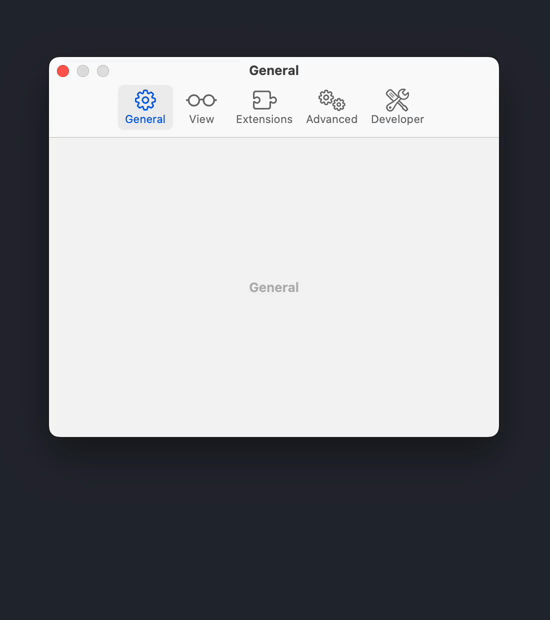
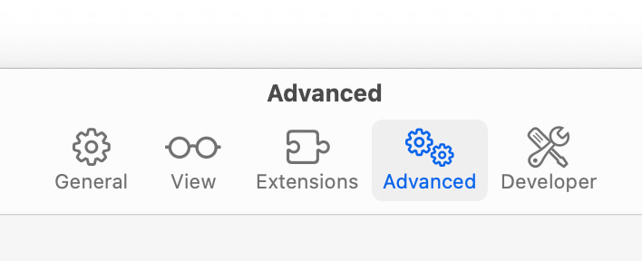
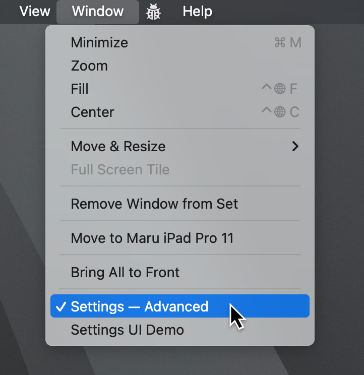
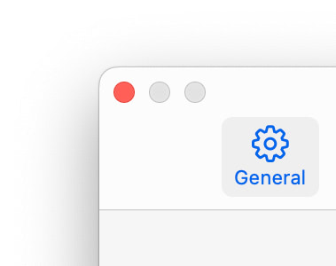
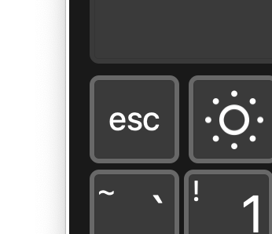
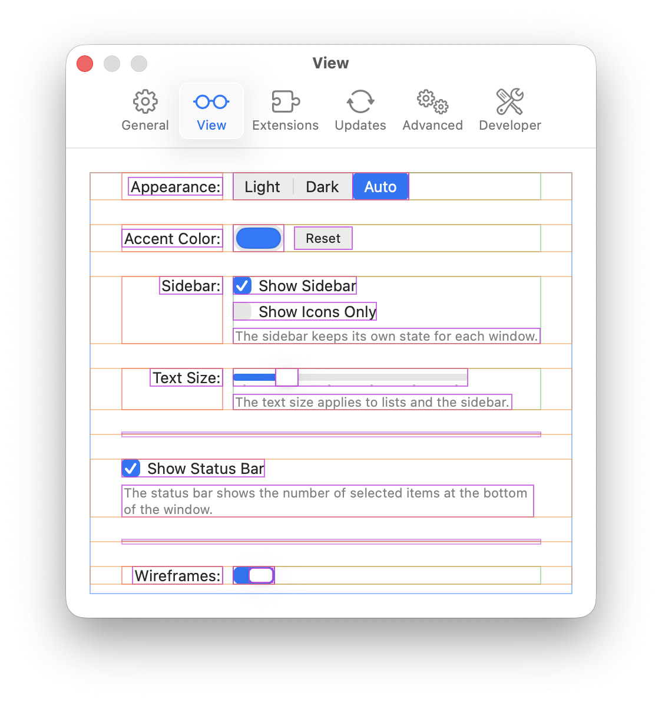
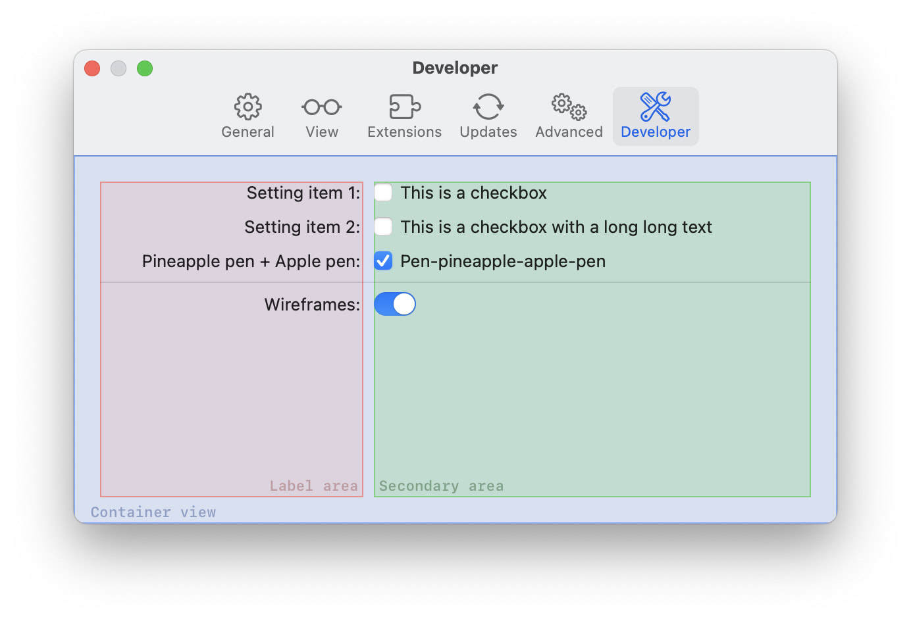

# MacAppSettingsUI

A package for make easier implementing a structure of settings / preferences UI for macOS AppKit-based apps.



## Design and Features

### Preferences-Style Toolbar with Animation

The window has preferences-style toolbar and native switching animation. It also supports “Reduce Motion” feature of accessibility.




### Window Title

Set active pane name as a window title automatically when panes are switched.




### Window Title with Active Pane Name on Window Menu

Display window title with pane name on the Window menu automatically.




### Only Close Button

Basically, the window only has a close button, but a zoom button is optional for per-pane.




### Press Escape Key to Close

We can use the Escape key `⎋` or `⌘.` action to close the window.




### Restorable Window Frame

The settings Window supports autosave frame via UserDefaults. The last window position can be restored automatically.


### Supported for Renamed “Settings”

On before macOS Ventura, “Settings” was “Preferences”. This module can also support renamed “Settings” after Ventura.

More details of this design (Japanese): [macOS Venturaからの新しい“Settings”表記と、旧“Preferences”表記からの移行](https://zenn.dev/usagimaru/articles/de5012155f4916)


### Pane Layout Helpers

Building the standard “label on the left, controls on the right” form by hand means writing the same constraints over and over. Two helpers are provided to avoid that, and both are supported.

| Approach | What you write | Suited for |
|---|---|---|
| **Section-based** (recommended) | One call per row | The standard two-column settings form |
| Layout guide | Your own constraints against shared guides | Layouts that do not fit the two-column form |

The layout guide is not deprecated, but the section-based approach is considerably simpler for ordinary settings panes because it owns the column widths, the spacing and the wrapping of description text for you.

Both come with a wireframing feature for debugging. See [Building a Pane Layout](#building-a-pane-layout).

Section-based, with wireframes revealing the sections and the two columns:



Layout guide, with wireframes revealing the label area and the secondary area:




## Core Files

### `SettingsWindow`
Window for Settings window.

### `SettingsWindowController`
WindowController for Settings window.

### `SettingsTabViewController`
WindowController’s contentViewController. It manages tab transitions with a lazy loading architecture — pane content is loaded on demand when a tab is first selected, rather than all at once. A `loadingView` is displayed during transitions. You can show a loading label by setting `showsLoadingLabel` to true and customize its text with `loadingLabelText`.

If you prefer eager loading of all tabs, call `loadAllTabs()` explicitly.

### `SettingsPaneViewController`
The base view controller for setting pane. You can use this class to customize your own.

Override `loadPaneContent(completion:)` to perform asynchronous content loading before the pane is displayed. The `isPaneContentLoaded` flag is managed automatically by `SettingsTabViewController`.

Each pane captures its `preferredPaneSize` automatically in `viewDidLoad()`. If your subclass adds subviews or modifies constraints after `super.viewDidLoad()`, call `capturePreferredPaneSize()` at the end of your `viewDidLoad()` to recapture the correct size. See [Resolving the Pane Size](#resolving-the-pane-size).

### `SettingsLayoutView`
The container of the section-based layout. Stack sections into it and it decides the column widths, the spacing between sections and the width at which description text wraps. See [Building a Pane Layout](#building-a-pane-layout).

Please check the “General” and “View” tabs on the demo app, `GeneralSettingsPaneViewController` and `ViewSettingsPaneViewController` in `DemoViewControllers.swift`.

### `SettingsSectionView`
The base class of every section. It exposes a `contentGuide` holding the section content, and a `widthMode` deciding whether that box follows the two-column block or spans the whole container. See [Section Width](#section-width).

### `SettingsColumnSectionView`
A two-column section: one trailing-aligned label, and any number of leading-aligned items stacked downward.

### `SettingsSeparatorSectionView` / `SettingsButtonSectionView` / `SettingsCheckboxSectionView` / `SettingsCustomSectionView`
Sections without the label column. They span the whole container by default, and all but the separator can line up with the two-column block instead.

### `SettingsWrappingLabel`
The description label used by sections. It shrinks to its text and wraps only when the text does not fit the column.

### `SettingsPaneContainerView`
This is a convenient container view for the layout guide approach. It is disabled by default; if you wish to use it, first enable it using the `setContentContainerView(maximumWidth: labelLayoutGuideWidth:)` method of the `SettingsPaneLayoutGuide`. Then add any contents to this container view.

Please check the “Developer” tab on the demo app, `DeveloperSettingsPaneViewController` in `DemoViewControllers.swift` and `SettingsPaneContainerView`.

### `SettingsPaneLayoutGuide`
A protocol for a layout guide using `SettingsPaneContainerView`.


## Install
Use SwiftPM.


## Usage
To set panes of settings window, there are two ways of them.

### A. Initialize SettingsWindowController with the panes as an array

```swift
// First, initialize the SettingsWindowController instance
let settingsWindowController = SettingsWindowController(with: [/*panes*/])

// …like this:
let settingsWindowController = SettingsWindowController(with: [
	SettingsPaneViewController(tabName: "General",
							   tabImage: NSImage(systemSymbolName: "gearshape", accessibilityDescription: nil),
							   tabIdentifier: "general",
							   isResizableView: false),
	SettingsPaneViewController(tabName: "View",
							   tabImage: NSImage(systemSymbolName: "eyeglasses", accessibilityDescription: nil),
							   tabIdentifier: "view",
							   isResizableView: true),
	SettingsPaneViewController(tabName: "Extensions",
							   tabImage: NSImage(systemSymbolName: "puzzlepiece.extension", accessibilityDescription: nil),
							   tabIdentifier: "extensions",
							   isResizableView: false),
	SettingsPaneViewController(tabName: "Advanced",
							   tabImage: NSImage(systemSymbolName: "gearshape.2", accessibilityDescription: nil),
							   tabIdentifier: "advanced",
							   isResizableView: false),
])

// That’s all. Then you can show the settings window.
settingsWindowController.showWindow(nil)

```

### B. Set panes to a SettingsTabViewController instance

```swift
func set(panes: [SettingsPaneViewController])
func add(panes: [SettingsPaneViewController])
func insert(panes: [SettingsPaneViewController], at index: Int)
func insert(tabViewItem: NSTabViewItem, at index: Int)
```

To remove any pane, use NSTabViewController’s methods.


## Building a Pane Layout

### Section-Based Layout (recommended)

Create a `SettingsLayoutView`, install it into the pane view, then add one section per row. `install(in:margins:)` pins the layout view to the pane view, with the system standard spacing on all four edges unless you pass `.insets(_:)` for your own margins.

```swift
class GeneralSettingsPaneViewController: SettingsPaneViewController {

	private var layoutView: SettingsLayoutView?

	override func loadView() {
		view = NSView()

		let layoutView = SettingsLayoutView()
		layoutView.install(in: view)
		self.layoutView = layoutView

		let startup = layoutView.addColumnSection(label: "Startup", identifier: .init("Startup"))
		startup.addCheckbox(title: "Open at Login", target: self, action: #selector(toggleItem(_:)))

		let downloads = layoutView.addColumnSection(label: "Save Downloads To", identifier: .init("Downloads"))
		let location = downloads.addPopUpButton(target: self, action: #selector(selectItem(_:)))
		location.addItems(withTitles: ["Downloads Folder", "Desktop", "Ask Each Time"])
		downloads.addDescriptionLabel("Choose where downloaded files are saved.")

		layoutView.addSeparatorSection()

		layoutView.addButtonSection(title: "Restore Defaults", target: self, action: #selector(restoreDefaults(_:)))
	}

}
```


#### Sections

Sections are stacked in the order you add them, spaced by `SettingsLayoutMetrics.sectionSpacing`. You never place them yourself.

| Method | Result |
|---|---|
| `addColumnSection(label:itemColumnMaximumWidth:identifier:)` | Two-column section |
| `addSeparatorSection(identifier:)` | Horizontal separator, always spanning the container |
| `addButtonSection(title:controlSize:alignment:widthMode:identifier:target:action:)` | A single button, without the label column |
| `addCheckboxSection(title:isOn:description:widthMode:identifier:target:action:)` | A leading-aligned checkbox with an optional description, without the label column |
| `addCustomSection(_:widthMode:identifier:)` | Any view, without the label column |


#### Section Width

A section without the label column decides the area it is laid out in with `SettingsSectionWidthMode`.

| Case | Result |
|---|---|
| `.fullWidth` (default) | The section spans the whole container, so its content reaches the pane margins |
| `.contentBlock` | The section follows the two-column block, so its edges line up with the column sections |

The two only look different once the columns are narrower than the pane, because the block stays centered while the container does not. A separator divides the whole pane, so it always spans the container and takes no width mode.

```swift
layoutView.addButtonSection(title: "Restore Defaults",
							alignment: .trailing,
							widthMode: .contentBlock,
							target: self,
							action: #selector(restoreDefaults(_:)))
```

`widthMode` is also a property on `SettingsSectionView`, so a section can be switched over after it has been added.


#### Items in a Two-Column Section

Items added to the same section stack downward, spaced by `SettingsLayoutMetrics.itemSpacing`.

| Method | Result |
|---|---|
| `addCheckbox(title:isOn:target:action:)` | Checkbox |
| `addButton(title:controlSize:target:action:)` | Push button |
| `addPopUpButton(controlSize:target:action:)` | Pop-up button |
| `addDescriptionLabel(_:)` | Supplementary description text |
| `addCustomView(_:verticalAlignment:)` | Any view |
| `addAccessoryView(_:to:spacing:)` | Any view, placed on the trailing side of an item you already added |

`verticalAlignment` decides how the label lines up with the first item: `.firstBaseline` (default), `.top` or `.centerY`. Use `.centerY` for controls that have no text baseline, such as a switch or a color well.


#### Column Widths

You do not set the column widths. The label column follows its longest label, and the item column follows whatever its items need — including the width a description label wants before it has to wrap. Whatever is left over becomes equal margins on both sides, so the whole block stays centered.

Two knobs are available.

| Knob | Effect |
|---|---|
| `itemColumnMaximumWidth` | Caps the item column. Long descriptions then wrap at that width instead of widening the pane |
| `SettingsLayoutView.itemColumnMinimumWidth` (default 200) | Floors the item column, which effectively decides the minimum pane width |

The item column is shared across every section, so passing `itemColumnMaximumWidth` on any one `addColumnSection` call applies it to the whole pane. It is also available as a property on `SettingsColumnSectionView`.


#### Resolving the Pane Size

`SettingsTabViewController` sizes the window from each pane’s `preferredPaneSize`. For a pane built in code, call `sizePaneToFitContent(minimumWidth:)` at the end of `loadView()`. It gives the view a lower bound, shrink-wraps it to the sections and records the result.

```swift
override func loadView() {
	view = NSView()

	buildSections()
	sizePaneToFitContent(minimumWidth: 450)
}
```

Description labels only learn the width they wrap at during layout, so the method measures repeatedly until the size stops changing. It is safe to call again with a different lower bound.

For a pane sized by a Storyboard or by your own constraints, call `capturePreferredPaneSize()` instead. It lays the view out and records the resulting frame size, without touching the width.


#### Re-measuring After a Change

`preferredPaneSize` is a snapshot, and `SettingsTabViewController` caches it again per tab. Neither notices a later change to the content, the font size or the locale.

Call `invalidatePaneSize()` on the pane to measure again and refresh both caches. The window resizes to follow only while that pane is the one on screen.

```swift
layoutView?.addColumnSection(label: "Sync", identifier: .init("Sync"))
invalidatePaneSize()
```


#### Reaching Sections Afterwards

Pass an `identifier` when adding a section if you want to find it later.

```swift
var sections: [SettingsSectionView]
var columnSections: [SettingsColumnSectionView]

func section(with identifier: NSUserInterfaceItemIdentifier) -> SettingsSectionView?
func columnSection(with identifier: NSUserInterfaceItemIdentifier) -> SettingsColumnSectionView?
func moveSection(_ identifier: NSUserInterfaceItemIdentifier, to index: Int)
func swapSections(_ first: NSUserInterfaceItemIdentifier, _ second: NSUserInterfaceItemIdentifier)
```


#### Wireframes

`layoutView.debug_setWireframes(true)` outlines each level in its own color: the container, every section, the label column, the item column and the controls. It has no effect outside a `DEBUG` build, and it also reaches sections added after the call.


### Layout Guide

Enable the container view, set the label column width if you need to, then constrain your own views against `labelLayoutGuide` and `secondaryAreaLayoutGuide`. Setting `maximumWidth` to nil lets the container behave flexibly.

```swift
class AdvancedSettingsPaneViewController: SettingsPaneViewController, SettingsPaneLayoutGuide {

	var contentContainerView: SettingsPaneContainerView?

	override func viewDidLoad() {
		super.viewDidLoad()

		setContentContainerView(maximumWidth: 550)
		contentContainerView?.labelLayoutGuideWidth = 160
		contentContainerView?.debug_setWireframes(true)
		capturePreferredPaneSize()
	}

}
```


## Appearance of Tabs

There are properties of tab item in `SettingsPaneViewController`.

### `tabName`
Default tab name, alias of `NSViewController.title`.

### `tabImage`
Icon for a tab.

### `tabIdentifier`
Should set to a unique name.

### `localizeKeyForTabName`
This key is used for localizing tab name process automatically.

If you use this, SettingsTabViewController replaces `tabName` with the localized tab name. You can disable this feature with using a property `disablesLocalizationWithTabNameLocalizeKey` on SettingsTabViewController.

This is useful when initializing view controllers in Interface Builder, but in normal cases, use `String(localized: “ANY KEY”)` (or `NSLocalizedString()`) for `tabName` property.


## Controlling window resizing behavior on a per-pane

SettingsPaneViewController has the property `isResizableView`; setting true to allow window resizing only while the pane is active. The default value is false. Check the Demo implementation and `Main` Storyboard file.


## Toolbar minimum width clamping

`SettingsTabViewController` has a `clampsToToolbarMinimumWidth` property (default: `true`). When enabled, all pane widths are clamped to at least the minimum content width imposed by the toolbar layout. This prevents visual flicker when a pane's preferred width is narrower than the toolbar requires.


## License

See [LICENSE](./LICENSE) for details.
