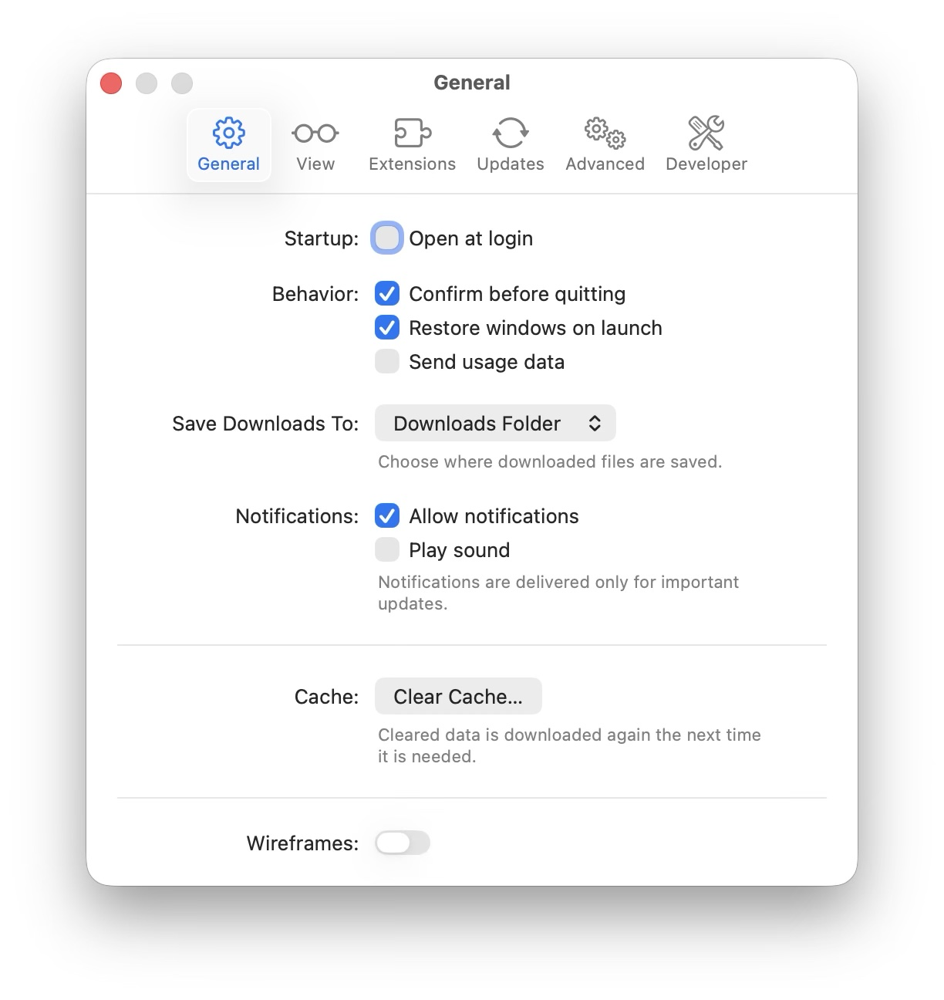
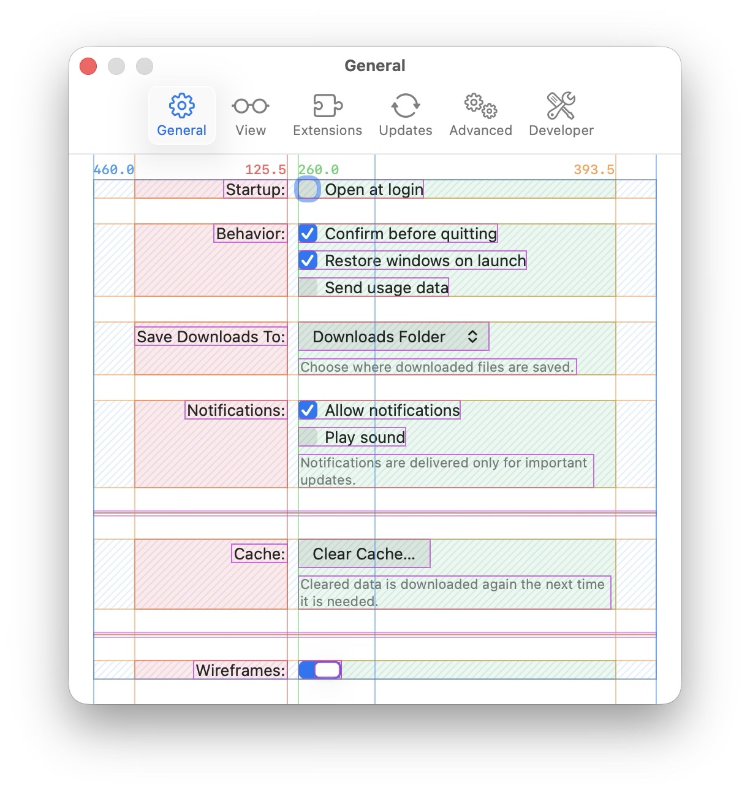
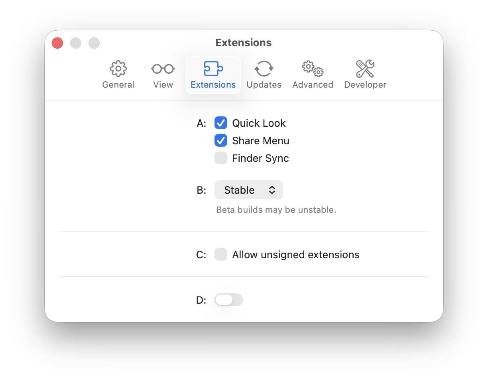
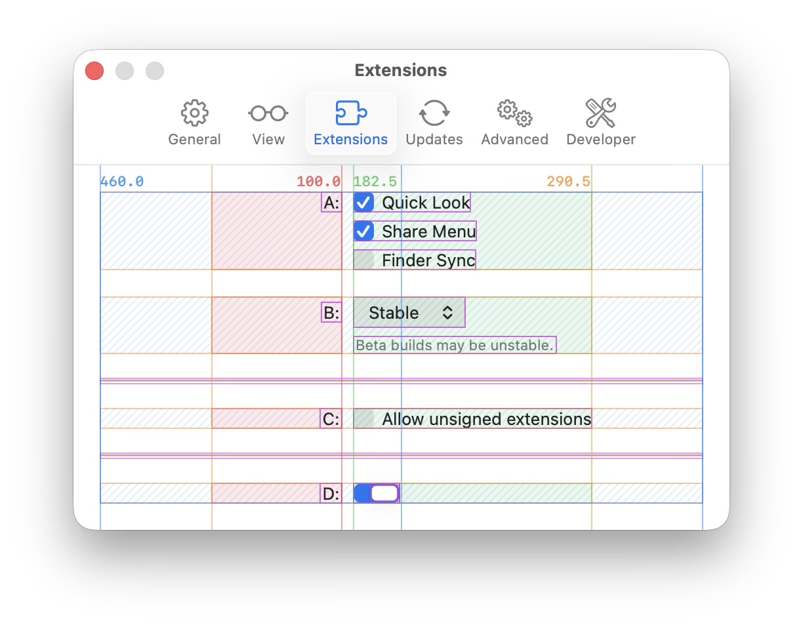

# MacAppSettingsUI

A package for building settings / preferences UI in macOS AppKit-based apps.



## Design and Features

### Preferences-Style Toolbar with Animation

The window has a preferences-style toolbar and the native switching animation. It also supports the “Reduce Motion” accessibility setting.


### Window Title

The name of the active pane becomes the window title automatically when panes are switched.


### Window Title with Active Pane Name on Window Menu

The Window menu shows that same title, so the active pane is named there too.


### Only Close Button

The window normally has only a close button. A zoom button can be added per pane.


### Press Escape Key to Close

The Escape key `⎋` and `⌘.` both close the window.


### Restorable Window Frame

The settings window autosaves its frame through UserDefaults, so the last position is restored automatically.


### Supported for Renamed “Settings”

Before macOS Ventura, “Settings” was called “Preferences”. This module supports both names.

More details of this design (Japanese): [macOS Venturaからの新しい“Settings”表記と、旧“Preferences”表記からの移行](https://zenn.dev/usagimaru/articles/de5012155f4916)


### Pane Layout Helpers

Building the standard “label on the left, controls on the right” form by hand means writing the same constraints over and over. Two helpers are provided to avoid that, and both are supported.

The **section-based** layout is the recommended one. You add one section per row and it owns the column widths, the spacing and the wrapping of description text for you.

The **guide-based** layout is not deprecated. You write your own constraints against shared layout guides, which is what you want for a pane that does not fit the two-column form.

Both come with a wireframing feature for debugging. See [Building a Pane Layout](#building-a-pane-layout).

**Section-based:**



**Guide-based:**


## Structure

`SettingsWindow` and `SettingsWindowController` make up the settings window itself. The window controller’s `contentViewController` is a `SettingsTabViewController`, which owns the panes and manages the tab transitions.

Panes are loaded lazily: content is loaded when a tab is first selected rather than all at once, and a loading view is shown during the transition. Call `loadAllTabs()` if you prefer eager loading instead.

Every pane is a `SettingsPaneViewController` subclass. Override `loadPaneContent(completion:)` to load content asynchronously before the pane is displayed. Each pane also records its preferred size during `viewDidLoad()`; see [Resolving the Pane Size](#resolving-the-pane-size) if your subclass builds its content there.

For the section-based layout, a `SettingsLayoutView` holds the sections and decides the geometry. Sections come in two shapes: `SettingsColumnSectionView` for the two-column row (one trailing-aligned label, any number of leading-aligned items), and the label-less ones — separator, button, checkbox and custom — which span the whole container by default. Description text uses `SettingsWrappingLabel`, which wraps only when the text does not fit its column.

For the guide-based layout, the `SettingsPaneLayoutGuide` protocol installs a `SettingsPaneContainerView` that vends the shared layout guides.

`LayoutDebugWireframes` draws the debugging overlay. The section-based layout is built on it, and it is public so you can use it on your own views. See [Wireframes](#wireframes).

The demo app covers all of it: the “General”, “View” and “Extensions” tabs for the section-based layout, and the “Developer” tab for the guide-based one. See `DemoViewControllers.swift`.


## Install
Use SwiftPM.


## Usage
There are two ways to give the settings window its panes.

### A. Initialize SettingsWindowController with the panes as an array

```swift
// First, initialize the SettingsWindowController instance
let settingsWindowController = SettingsWindowController(with: [/*panes*/])

// …like this:
let settingsWindowController = SettingsWindowController(with: [
	SettingsPaneViewController(tabName: "General",
							   tabImage: NSImage(systemSymbolName: "gearshape", accessibilityDescription: nil),
							   tabIdentifier: "general",
							   isResizableView: false),
	SettingsPaneViewController(tabName: "View",
							   tabImage: NSImage(systemSymbolName: "eyeglasses", accessibilityDescription: nil),
							   tabIdentifier: "view",
							   isResizableView: true),
	SettingsPaneViewController(tabName: "Extensions",
							   tabImage: NSImage(systemSymbolName: "puzzlepiece.extension", accessibilityDescription: nil),
							   tabIdentifier: "extensions",
							   isResizableView: false),
	SettingsPaneViewController(tabName: "Advanced",
							   tabImage: NSImage(systemSymbolName: "gearshape.2", accessibilityDescription: nil),
							   tabIdentifier: "advanced",
							   isResizableView: false),
])

// That’s all. Then you can show the settings window.
settingsWindowController.showWindow(nil)

```

### B. Set panes to a SettingsTabViewController instance

`SettingsTabViewController` takes panes through its own `set`, `add` and `insert` methods. To remove a pane, use `NSTabViewController`’s own methods.


## Building a Pane Layout

### Section-Based Layout (recommended)

Create a `SettingsLayoutView`, install it into the pane view, then add one section per row. `install(in:margins:)` pins the layout view to the pane view, with the system standard spacing on all four edges unless you pass `.insets(_:)` for your own margins.

```swift
class GeneralSettingsPaneViewController: SettingsPaneViewController {

	private var layoutView: SettingsLayoutView?

	override func loadView() {
		view = NSView()

		let layoutView = SettingsLayoutView()
		layoutView.install(in: view)
		self.layoutView = layoutView

		let startup = layoutView.addColumnSection(label: "Startup", identifier: .init("Startup"))
		startup.addCheckbox(title: "Open at Login", target: self, action: #selector(toggleItem(_:)))

		let downloads = layoutView.addColumnSection(label: "Save Downloads To", identifier: .init("Downloads"))
		let location = downloads.addPopUpButton(target: self, action: #selector(selectItem(_:)))
		location.addItems(withTitles: ["Downloads Folder", "Desktop", "Ask Each Time"])
		downloads.addDescriptionLabel("Choose where downloaded files are saved.")

		layoutView.addSeparatorSection()

		layoutView.addButtonSection(title: "Restore Defaults", target: self, action: #selector(restoreDefaults(_:)))
	}

}
```


#### Sections

Sections are stacked in the order you add them, spaced by `SettingsLayoutMetrics.sectionSpacing`. You never place them yourself.

`addColumnSection` builds the two-column row. The rest — separator, button, checkbox and custom — drop the label column, and the custom one takes any view you hand it.

Items added to a two-column section stack downward, spaced by `SettingsLayoutMetrics.itemSpacing`. The section vends checkboxes, push buttons and pop-up buttons ready-made, takes description text and arbitrary views, and can place an accessory view on the trailing side of an item you already added.

When adding an item you can choose how the label lines up with it: `.firstBaseline` (default), `.top` or `.centerY`. Use `.centerY` for controls that have no text baseline, such as a switch or a color well.


#### Section Width

A section without the label column decides the area it is laid out in with `SettingsSectionWidthMode`. `.fullWidth` (the default for the `add…Section` methods) spans the whole container, so the content reaches the pane margins. `.contentBlock` follows the two-column block instead, so the edges line up with the column sections.

The two only look different once the columns are narrower than the pane, because the block stays centered while the container does not. A separator divides the whole pane, so it always spans the container and takes no width mode.

```swift
layoutView.addButtonSection(title: "Restore Defaults",
							alignment: .trailing,
							widthMode: .contentBlock,
							target: self,
							action: #selector(restoreDefaults(_:)))
```

`widthMode` is also a property on `SettingsSectionView`, so a section can be switched over after it has been added, and a section you build yourself starts at `.contentBlock`.


#### Column Widths

You do not set the column widths. The label column follows its longest label, and the item column follows whatever its items need — including the width a description label wants before it has to wrap. Whatever is left over becomes equal margins on both sides, so the whole block stays centered.

Three knobs are available, all of them unset by default: a maximum width for the item column, and a minimum for each of the two columns.

The item column maximum works in both directions despite its name. It caps the column, so a long description wraps instead of widening the pane, and it floors it as well, so the column keeps that width even when the items are narrower. Declaring it on any one `addColumnSection` call reaches the whole pane, because the item column is shared across every section. When several sections declare a width, the narrowest one wins — that is the only value all of them can satisfy at once.

Leaving a column unset lets it hug its content, at the cost of a pane that grows and shrinks with whatever is in it.

The label column minimum is worth reaching for when the labels are far shorter than the items. Without it the block is still centered, but it reads as left-heavy: the label column collapses while the item column does not, so the visible content drifts away from the middle of the pane.

The “Extensions” pane of the demo app combines the two. It declares no width for the item column, and floors the label column at 100.



The wireframes make the difference plain: the item column settles on its widest item, while the label column sits exactly on the floor rather than on its one-letter labels.




#### Resolving the Pane Size

`SettingsTabViewController` sizes the window from each pane’s `preferredPaneSize`. For a pane built in code, call `sizePaneToFitContent(minimumWidth:)` at the end of `loadView()`. It gives the view a lower bound, shrink-wraps it to the sections and records the result.

```swift
override func loadView() {
	view = NSView()

	buildSections()
	sizePaneToFitContent(minimumWidth: 450)
}
```

Description labels only learn the width they wrap at during layout, so the method measures repeatedly until the size stops changing. It is safe to call again with a different lower bound.

For a pane sized by a Storyboard or by your own constraints, call `capturePreferredPaneSize()` instead. It lays the view out and records the resulting frame size, without touching the width.


#### Embedding SwiftUI Views

`NSHostingView` resolves its SwiftUI layout only once it belongs to a window. Until then it ignores environment values such as `controlSize` and reports the default size instead. A pane is measured during `loadView()`, before it reaches a window, so that difference is left over as slack at the bottom of the layout.

Settle the size at initialization by putting the hosting view into a window and running a single layout pass. The window is already reachable during `loadView()` through `tabViewController?.view.window`.

```swift
final class DemoSwitch: NSHostingView<DemoSwitchView> {

	convenience init(sizingWindow: NSWindow?, onChange: @escaping (Bool) -> Void) {
		self.init(rootView: DemoSwitchView(onChange: onChange))
		settleIntrinsicContentSize(in: sizingWindow)
	}

	private func settleIntrinsicContentSize(in window: NSWindow?) {
		guard let contentView = window?.contentView else { return }

		contentView.addSubview(self)
		layoutSubtreeIfNeeded()
		removeFromSuperview()
	}

}
```

`addSubview(_:)` alone does not settle anything, the layout pass is what does. Once resolved the size sticks, even after the view leaves the window again. See `DemoSwitch` in `Supports.swift` of the demo app.

Avoid measuring the pane again after it appears. Resizing the window from `viewDidAppear()` competes with the window presentation and the tab transition.


#### Re-measuring After a Change

`preferredPaneSize` is a snapshot, and `SettingsTabViewController` caches it again per tab. Neither notices a later change to the content, the font size or the locale.

Call `invalidatePaneSize()` on the pane to measure again and refresh both caches. The window resizes to follow only while that pane is the one on screen.

```swift
layoutView?.addColumnSection(label: "Sync", identifier: .init("Sync"))
invalidatePaneSize()
```


#### Reaching Sections Afterwards

Pass an `identifier` when adding a section if you want to find it later. `SettingsLayoutView` vends its sections as arrays, looks one up by identifier, and can move or swap them by identifier as well.


#### Wireframes

`layoutView.debug_setWireframes(true)` reveals the layout. It has no effect outside a `DEBUG` build, and it also reaches sections added after the call.


Sections appear as blue hatching, the label and item columns as red and green areas, and the labels and controls inside them as purple outlines. Vertical rules mark the container edges and center, the block edges and the inner edge of each column, and the measured widths are printed along the top.

The rules run the whole height of the pane and past its margins, so a section whose edge is off shows up at a glance. The numbers carry a decimal, since Auto Layout hands out fractions and a hair of misalignment is worth seeing.

The drawing is done by `LayoutDebugWireframes`, which is public and tied to nothing in particular. You can register your own views and layout guides with it, as borders, fills, hatching, rules or width readouts.

```swift
let wireframes = LayoutDebugWireframes(host: someView)
wireframes.add(guide: someGuide, color: .systemRed)
wireframes.addRule(at: .maxX, of: someGuide, color: .systemRed)
wireframes.isEnabled = true

// From the host’s layout()
wireframes.updateLayout()
```

A view is bordered through its own layer, so Auto Layout keeps that one in place. Everything else is drawn by layers laid into the host, which is why `updateLayout()` has to run from the host’s `layout()`. Call `refresh()` after putting views inside an already registered view, and `removeAll()` to drop every registration.

`isEnabled` shows or hides everything at once, and assigning true does nothing outside a `DEBUG` build. `LayoutDebugWireframeColor` carries the colors the settings panes use; the line width and the alpha values are static properties on `LayoutDebugWireframes` itself.


### Guide-Based Layout (experimental)

Enable the container view, set the label column width if you need to, then constrain your own views against `labelLayoutGuide` and `secondaryAreaLayoutGuide`. Passing nil for `maximumWidth` lets the container grow freely.

```swift
class AdvancedSettingsPaneViewController: SettingsPaneViewController, SettingsPaneLayoutGuide {

	var contentContainerView: SettingsPaneContainerView?

	override func viewDidLoad() {
		super.viewDidLoad()

		setContentContainerView(maximumWidth: 550)
		contentContainerView?.labelLayoutGuideWidth = 160
		contentContainerView?.debug_setWireframes(true)
		capturePreferredPaneSize()
	}

}
```


## Appearance of Tabs

A tab is described by properties on `SettingsPaneViewController`: `tabName` (an alias of `NSViewController.title`), `tabImage` for the icon, and `tabIdentifier`, which should be unique.

`localizeKeyForTabName` localizes the tab name automatically — `SettingsTabViewController` replaces `tabName` with the localized one, unless you turn that off with its `disablesLocalizationWithTabNameLocalizeKey` property. This is useful when view controllers are initialized in Interface Builder. Otherwise, prefer `String(localized:)` or `NSLocalizedString()` when assigning `tabName`.


## Controlling Window Resizing Per Pane

Set `isResizableView` on `SettingsPaneViewController` to allow window resizing only while that pane is active. It defaults to false. See the demo implementation and the `Main` storyboard.


## Toolbar Minimum Width Clamping

`SettingsTabViewController` has a `clampsToToolbarMinimumWidth` property, enabled by default. It clamps every pane to at least the content width the toolbar layout requires, which prevents the flicker you would otherwise see when a pane prefers to be narrower than that.


## License

See [LICENSE](./LICENSE) for details.
